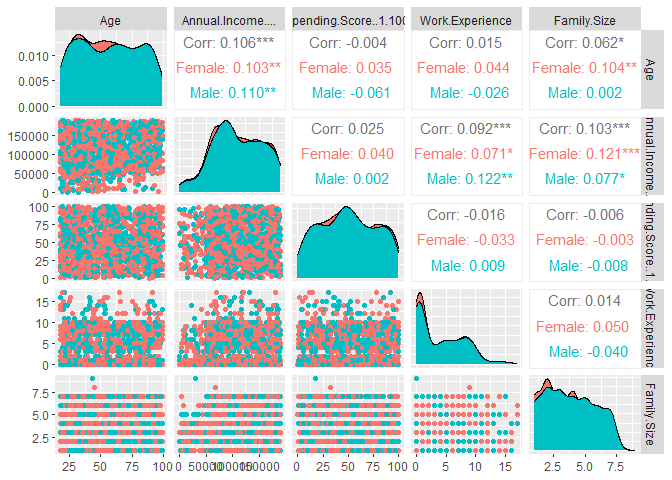
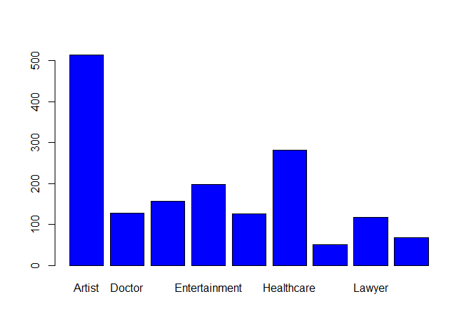
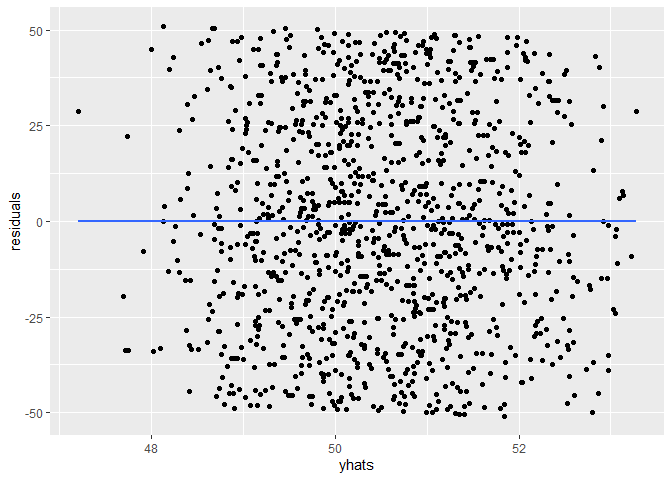

Customers Data Analysis Project Report
================
EricMulaa
2023-05-06

Loading data into rstudio

``` r
customers1 <- read.table(file = "Customers.csv", header = TRUE, sep = ",")
head(customers1)
```

    ##   CustomerID Gender Age Annual.Income.... Spending.Score..1.100.    Profession
    ## 1          1   Male  19             15000                     39    Healthcare
    ## 2          2   Male  21             35000                     81      Engineer
    ## 3          3 Female  20             86000                      6      Engineer
    ## 4          4 Female  23             59000                     77        Lawyer
    ## 5          5 Female  31             38000                     40 Entertainment
    ## 6          6 Female  22             58000                     76        Artist
    ##   Work.Experience Family.Size
    ## 1               1           4
    ## 2               3           3
    ## 3               1           1
    ## 4               0           2
    ## 5               2           6
    ## 6               0           2

``` r
str(customers1)
```

    ## 'data.frame':    2000 obs. of  8 variables:
    ##  $ CustomerID            : int  1 2 3 4 5 6 7 8 9 10 ...
    ##  $ Gender                : chr  "Male" "Male" "Female" "Female" ...
    ##  $ Age                   : int  19 21 20 23 31 22 35 23 64 30 ...
    ##  $ Annual.Income....     : int  15000 35000 86000 59000 38000 58000 31000 84000 97000 98000 ...
    ##  $ Spending.Score..1.100.: int  39 81 6 77 40 76 6 94 3 72 ...
    ##  $ Profession            : chr  "Healthcare" "Engineer" "Engineer" "Lawyer" ...
    ##  $ Work.Experience       : int  1 3 1 0 2 0 1 1 0 1 ...
    ##  $ Family.Size           : int  4 3 1 2 6 2 3 3 3 4 ...

``` r
summary(customers1)
```

    ##    CustomerID        Gender               Age        Annual.Income....
    ##  Min.   :   1.0   Length:2000        Min.   : 0.00   Min.   :     0   
    ##  1st Qu.: 500.8   Class :character   1st Qu.:25.00   1st Qu.: 74572   
    ##  Median :1000.5   Mode  :character   Median :48.00   Median :110045   
    ##  Mean   :1000.5                      Mean   :48.96   Mean   :110732   
    ##  3rd Qu.:1500.2                      3rd Qu.:73.00   3rd Qu.:149093   
    ##  Max.   :2000.0                      Max.   :99.00   Max.   :189974   
    ##  Spending.Score..1.100.  Profession        Work.Experience   Family.Size   
    ##  Min.   :  0.00         Length:2000        Min.   : 0.000   Min.   :1.000  
    ##  1st Qu.: 28.00         Class :character   1st Qu.: 1.000   1st Qu.:2.000  
    ##  Median : 50.00         Mode  :character   Median : 3.000   Median :4.000  
    ##  Mean   : 50.96                            Mean   : 4.103   Mean   :3.768  
    ##  3rd Qu.: 75.00                            3rd Qu.: 7.000   3rd Qu.:5.000  
    ##  Max.   :100.00                            Max.   :17.000   Max.   :9.000

Loading tidyverse package

``` r
library(tidyverse)
```

    ## ── Attaching core tidyverse packages ──────────────────────── tidyverse 2.0.0 ──
    ## ✔ dplyr     1.1.2     ✔ readr     2.1.4
    ## ✔ forcats   1.0.0     ✔ stringr   1.5.0
    ## ✔ ggplot2   3.4.2     ✔ tibble    3.2.1
    ## ✔ lubridate 1.9.2     ✔ tidyr     1.3.0
    ## ✔ purrr     1.0.1     
    ## ── Conflicts ────────────────────────────────────────── tidyverse_conflicts() ──
    ## ✖ dplyr::filter() masks stats::filter()
    ## ✖ dplyr::lag()    masks stats::lag()
    ## ℹ Use the conflicted package (<http://conflicted.r-lib.org/>) to force all conflicts to become errors

There are some entries with age as zero, which can be the case. I will
there filter these entries out

``` r
customers <- customers1 %>%
  filter(customers1$Age != 0)
summary(customers)
```

    ##    CustomerID        Gender               Age        Annual.Income....
    ##  Min.   :   1.0   Length:1976        Min.   : 1.00   Min.   :     0   
    ##  1st Qu.: 500.8   Class :character   1st Qu.:26.00   1st Qu.: 74572   
    ##  Median :1002.5   Mode  :character   Median :49.00   Median :109661   
    ##  Mean   :1000.1                      Mean   :49.55   Mean   :110678   
    ##  3rd Qu.:1498.2                      3rd Qu.:74.00   3rd Qu.:149137   
    ##  Max.   :2000.0                      Max.   :99.00   Max.   :189974   
    ##  Spending.Score..1.100.  Profession        Work.Experience   Family.Size   
    ##  Min.   :  0.0          Length:1976        Min.   : 0.000   Min.   :1.000  
    ##  1st Qu.: 28.0          Class :character   1st Qu.: 1.000   1st Qu.:2.000  
    ##  Median : 50.0          Mode  :character   Median : 3.000   Median :4.000  
    ##  Mean   : 50.9                             Mean   : 4.104   Mean   :3.765  
    ##  3rd Qu.: 75.0                             3rd Qu.: 7.000   3rd Qu.:5.000  
    ##  Max.   :100.0                             Max.   :17.000   Max.   :9.000

Also, there is a person with age of 1 year, lets see those with age less
than 10 years.

``` r
young <- customers %>%
  filter(customers$Age <= 10)
summary(young)
```

    ##    CustomerID      Gender               Age         Annual.Income....
    ##  Min.   : 211   Length:173         Min.   : 1.000   Min.   : 12000   
    ##  1st Qu.: 699   Class :character   1st Qu.: 3.000   1st Qu.: 86925   
    ##  Median :1195   Mode  :character   Median : 5.000   Median :124702   
    ##  Mean   :1144                      Mean   : 5.162   Mean   :121050   
    ##  3rd Qu.:1615                      3rd Qu.: 8.000   3rd Qu.:155864   
    ##  Max.   :1987                      Max.   :10.000   Max.   :189709   
    ##  Spending.Score..1.100.  Profession        Work.Experience   Family.Size  
    ##  Min.   :  1.00         Length:173         Min.   : 0.000   Min.   :1.00  
    ##  1st Qu.: 31.00         Class :character   1st Qu.: 1.000   1st Qu.:2.00  
    ##  Median : 57.00         Mode  :character   Median : 3.000   Median :3.00  
    ##  Mean   : 54.52                            Mean   : 4.237   Mean   :3.63  
    ##  3rd Qu.: 80.00                            3rd Qu.: 8.000   3rd Qu.:6.00  
    ##  Max.   :100.00                            Max.   :15.000   Max.   :8.00

There a person at the age of 1 and with a profession of a doctor and
another one an engineer. This is not consistent.

For this analysis will consider people with 18 years and above. There
are some values in Profession column that are empty, will get rid of
them too.

``` r
customers <- customers %>%
  filter(Age >= 18, customers$Profession != "")
```

I will then proceed to remove any incomplete cases

``` r
customers <- customers[complete.cases(customers), ]
summary(customers)
```

    ##    CustomerID        Gender               Age        Annual.Income....
    ##  Min.   :   1.0   Length:1638        Min.   :18.00   Min.   :     0   
    ##  1st Qu.: 466.5   Class :character   1st Qu.:36.00   1st Qu.: 72460   
    ##  Median : 990.0   Mode  :character   Median :56.00   Median :106601   
    ##  Mean   : 982.0                      Mean   :56.97   Mean   :108865   
    ##  3rd Qu.:1481.8                      3rd Qu.:78.00   3rd Qu.:148274   
    ##  Max.   :2000.0                      Max.   :99.00   Max.   :189974   
    ##  Spending.Score..1.100.  Profession        Work.Experience   Family.Size   
    ##  Min.   :  0.00         Length:1638        Min.   : 0.000   Min.   :1.000  
    ##  1st Qu.: 27.00         Class :character   1st Qu.: 1.000   1st Qu.:2.000  
    ##  Median : 49.50         Mode  :character   Median : 3.000   Median :4.000  
    ##  Mean   : 50.41                            Mean   : 4.012   Mean   :3.742  
    ##  3rd Qu.: 74.00                            3rd Qu.: 7.000   3rd Qu.:5.000  
    ##  Max.   :100.00                            Max.   :17.000   Max.   :9.000

I will now conert the Gender column to a factor.

``` r
customers$Gender <- as.factor(customers$Gender)
customers$Profession <- as.factor(customers$Profession)
```

This data looks good, and I will now start performing some analysis to
it, but before then, I will load some necessary packages.

``` r
library(ggplot2)
```

``` r
library(GGally)
```

    ## Registered S3 method overwritten by 'GGally':
    ##   method from   
    ##   +.gg   ggplot2

Let me visualize the correlation analysis for some columns.

``` r
GGally::ggpairs(customers, columns = c(3:5, 7:8), aes(color = Gender))
```

<!-- -->
From the plots above we can observe that Age and Annual income is
positively correlated, but it is greater for male than for female. Age
is also positively correlated to family size, with the correlation for
female being significant while than of male is not. Annual income is
positively correlated to work experience and family size. The
correlation for Annual income and work experience is more significant
for male than for female The correlation for Annual income and family
size is more significant for female than for male

I will have a look at my data and plot a simple graph to give a better
understanding.

``` r
head(customers)
```

    ##   CustomerID Gender Age Annual.Income.... Spending.Score..1.100.    Profession
    ## 1          1   Male  19             15000                     39    Healthcare
    ## 2          2   Male  21             35000                     81      Engineer
    ## 3          3 Female  20             86000                      6      Engineer
    ## 4          4 Female  23             59000                     77        Lawyer
    ## 5          5 Female  31             38000                     40 Entertainment
    ## 6          6 Female  22             58000                     76        Artist
    ##   Work.Experience Family.Size
    ## 1               1           4
    ## 2               3           3
    ## 3               1           1
    ## 4               0           2
    ## 5               2           6
    ## 6               0           2

``` r
str(customers)
```

    ## 'data.frame':    1638 obs. of  8 variables:
    ##  $ CustomerID            : int  1 2 3 4 5 6 7 8 9 10 ...
    ##  $ Gender                : Factor w/ 2 levels "Female","Male": 2 2 1 1 1 1 1 1 2 1 ...
    ##  $ Age                   : int  19 21 20 23 31 22 35 23 64 30 ...
    ##  $ Annual.Income....     : int  15000 35000 86000 59000 38000 58000 31000 84000 97000 98000 ...
    ##  $ Spending.Score..1.100.: int  39 81 6 77 40 76 6 94 3 72 ...
    ##  $ Profession            : Factor w/ 9 levels "Artist","Doctor",..: 6 3 3 8 4 1 6 6 3 1 ...
    ##  $ Work.Experience       : int  1 3 1 0 2 0 1 1 0 1 ...
    ##  $ Family.Size           : int  4 3 1 2 6 2 3 3 3 4 ...

``` r
plot(customers$Profession, col = "blue")
```

<!-- -->

I create a model that will show relationship between different aspects
in this data. I start setting a seed and sliptting this data to train
and test subsets.

``` r
set.seed(1234)
indexset <- sample(2, nrow(customers), replace = T, prob = c(0.7, 0.3))
train <- customers[indexset == 1,]
test <- customers[indexset == 2,]   
```

Let’s use now generate a model that will predict a customer’s spending
score.

``` r
mymodel <- lm(Spending.Score..1.100.~Age + Annual.Income.... + 
                 Work.Experience + Family.Size, data = train)
summary(mymodel)
```

    ## 
    ## Call:
    ## lm(formula = Spending.Score..1.100. ~ Age + Annual.Income.... + 
    ##     Work.Experience + Family.Size, data = train)
    ## 
    ## Residuals:
    ##     Min      1Q  Median      3Q     Max 
    ## -50.846 -22.089  -1.104  24.264  50.872 
    ## 
    ## Coefficients:
    ##                     Estimate Std. Error t value Pr(>|t|)    
    ## (Intercept)        4.928e+01  3.105e+00  15.871   <2e-16 ***
    ## Age               -2.408e-02  3.492e-02  -0.690    0.491    
    ## Annual.Income....  2.166e-05  1.811e-05   1.196    0.232    
    ## Work.Experience   -6.731e-03  2.111e-01  -0.032    0.975    
    ## Family.Size        7.209e-02  4.226e-01   0.171    0.865    
    ## ---
    ## Signif. codes:  0 '***' 0.001 '**' 0.01 '*' 0.05 '.' 0.1 ' ' 1
    ## 
    ## Residual standard error: 27.93 on 1164 degrees of freedom
    ## Multiple R-squared:  0.001584,   Adjusted R-squared:  -0.001847 
    ## F-statistic: 0.4617 on 4 and 1164 DF,  p-value: 0.7639

we can use our trained model to make predictions on our testing data

``` r
train <- train %>%
  mutate(yhats = predict(mymodel, newdata = train))
head(train)
```

    ##   CustomerID Gender Age Annual.Income.... Spending.Score..1.100. Profession
    ## 1          1   Male  19             15000                     39 Healthcare
    ## 2          2   Male  21             35000                     81   Engineer
    ## 3          3 Female  20             86000                      6   Engineer
    ## 4          4 Female  23             59000                     77     Lawyer
    ## 6          6 Female  22             58000                     76     Artist
    ## 7          7 Female  35             31000                      6 Healthcare
    ##   Work.Experience Family.Size    yhats
    ## 1               1           4 49.42708
    ## 2               3           3 49.72649
    ## 3               1           1 50.72431
    ## 4               0           2 50.14617
    ## 6               0           2 50.14860
    ## 7               1           3 49.31617

The residuals for predicted values as well

``` r
train <- train %>%
  mutate(residuals = Spending.Score..1.100. - yhats)
head(train)
```

    ##   CustomerID Gender Age Annual.Income.... Spending.Score..1.100. Profession
    ## 1          1   Male  19             15000                     39 Healthcare
    ## 2          2   Male  21             35000                     81   Engineer
    ## 3          3 Female  20             86000                      6   Engineer
    ## 4          4 Female  23             59000                     77     Lawyer
    ## 6          6 Female  22             58000                     76     Artist
    ## 7          7 Female  35             31000                      6 Healthcare
    ##   Work.Experience Family.Size    yhats residuals
    ## 1               1           4 49.42708 -10.42708
    ## 2               3           3 49.72649  31.27351
    ## 3               1           1 50.72431 -44.72431
    ## 4               0           2 50.14617  26.85383
    ## 6               0           2 50.14860  25.85140
    ## 7               1           3 49.31617 -43.31617

Now our data has more variables and we can now perform ‘cross-validation
correlation.’ The correlation between predictions and the actual values.

``` r
train %>%
  summarise(cor = cor(Spending.Score..1.100., yhats))
```

    ##          cor
    ## 1 0.03980214

If we square this value it will give us the R-squared

``` r
train %>%
  summarise(cor = cor(Spending.Score..1.100., yhats)) %>%
  mutate(R2 = cor**2)
```

    ##          cor          R2
    ## 1 0.03980214 0.001584211

Now lets quantify the difference between the R2 of the train data and
the square cross validation

``` r
train %>%
  summarise(cor = cor(Spending.Score..1.100., yhats)) %>%
  mutate(R2 = cor**2, shrinkage = summary(mymodel)$r.squared - R2)
```

    ##          cor          R2     shrinkage
    ## 1 0.03980214 0.001584211 -3.252607e-18

we want smaller shrinkage values. The book says ‘we won’t give any hard
and fast rules’ for shrinkage values, but ‘shrinkage of 10% or less
should not be a problem, but a shrinkage of more than 50% would be
worrisome’

Lets look at the residual plots of our testing data

``` r
ggplot(train, aes(x = yhats, y = residuals)) + 
  geom_point() + 
  geom_smooth(se = FALSE)
```

    ## `geom_smooth()` using method = 'gam' and formula = 'y ~ s(x, bs = "cs")'

<!-- -->

The mean of the residuals should be zero

``` r
train %>%
  summarise(mean(residuals), sd(residuals))
```

    ##   mean(residuals) sd(residuals)
    ## 1   -8.290679e-15      27.88426

``` r
sd(residuals(mymodel))
```

    ## [1] 27.88426

We expect the mean of residuals to be close to zero, and it is, and the
standard deviation of residuals to be close to the standard deviation of
the error term from the fir to the training sample.

##### Those look pretty good!
